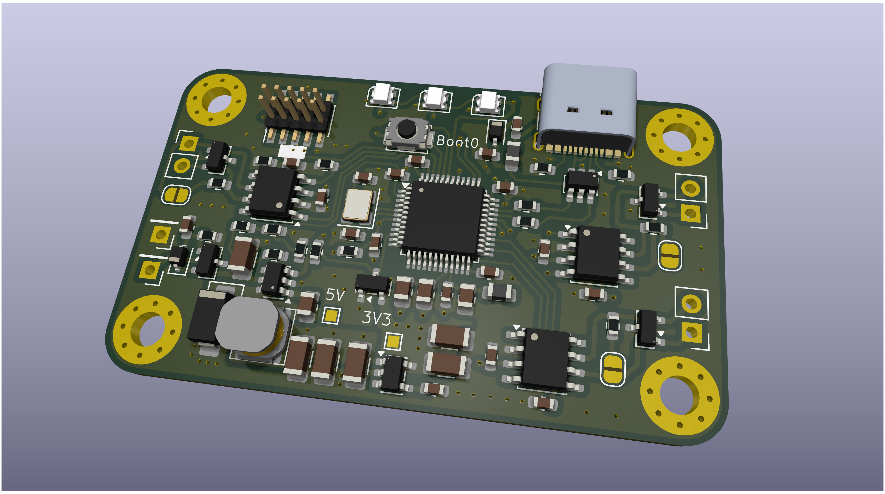

# CAN Filter

[Схема платы](./canfilter_g4.pdf)

# Примеры кода

- [AEM2ABIT](https://github.com/Sergey1560/canfilter_aem2abit) конвертирует сообщения от ШДК AEM в формат ADLM ABIT
- [SOCKET_CAN](https://github.com/Sergey1560/canfilter_socketcan_sw) USB адаптер для Linux с 3-мя интерфейсами CAN
